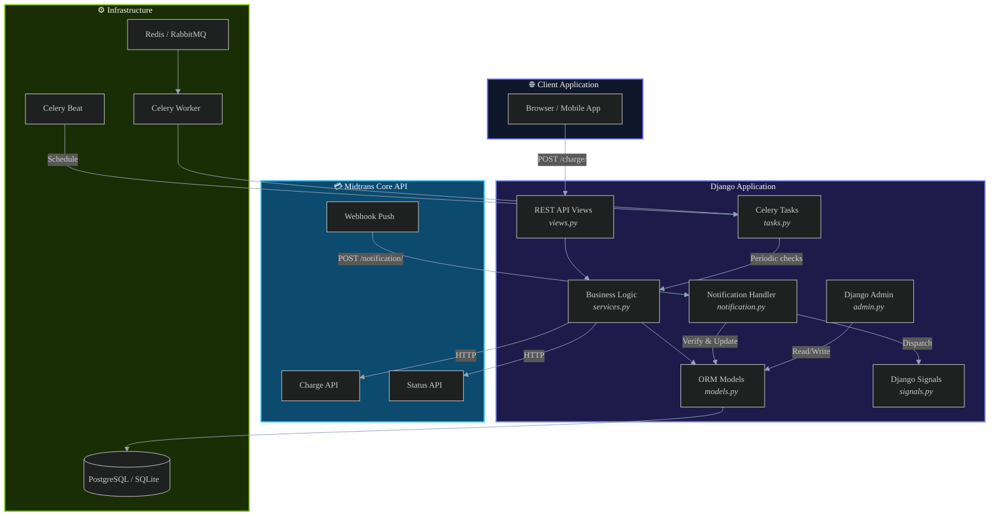
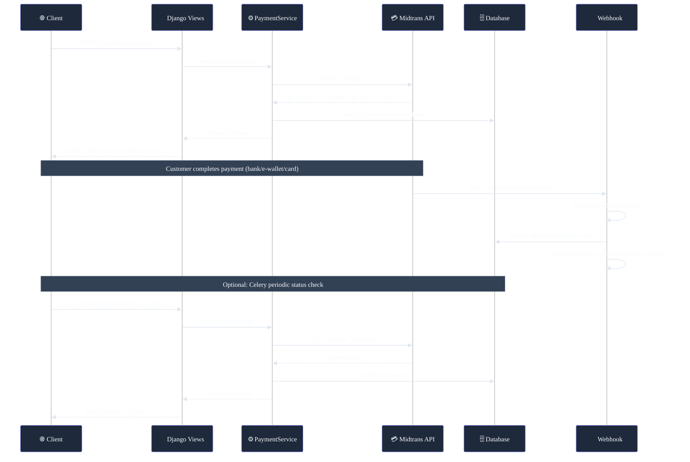
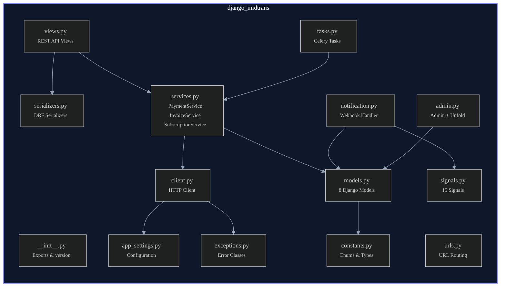
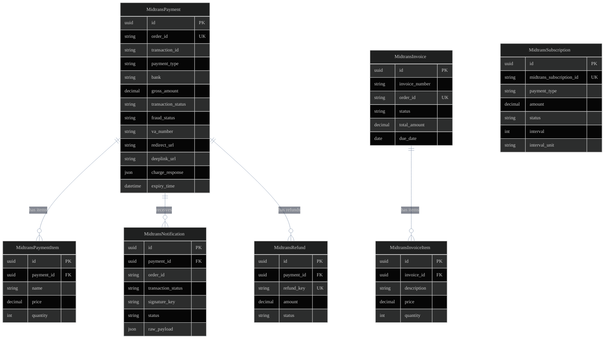

# Django Payment Midtrans

<p align="center">
  
  
  
  
</p>

A comprehensive, production-ready Django package for **Midtrans Core API** payment gateway integration. Handles all payment methods, invoicing, subscriptions, webhook notifications, and integrates seamlessly with Django Admin (Unfold), Django REST Framework, and Celery.

> **Note**: This package uses the Midtrans **Core API** directly — NOT Snap/Pop-up.

---

## Table of Contents

- [Features](#features)
- [Architecture](#architecture)
- [Installation](#installation)
- [Quick Start](#quick-start)
- [Configuration Reference](#configuration-reference)
- [API Endpoints](#api-endpoints)
- [Payment Methods](#payment-methods)
- [Webhook Notifications](#webhook-notifications)
- [Signals](#signals)
- [Celery & Async Tasks](#celery--async-tasks)
- [Django Admin](#django-admin)
- [Running the Example App](#running-the-example-app)
- [Production Deployment](#production-deployment)
- [Contributing](#contributing)
- [License](#license)

---

## Features

| Category | Details |
|----------|---------|
| **Core API** | Charge, cancel, expire, refund, capture, status check |
| **Payment Methods** | Credit Card (3DS), GoPay, ShopeePay, DANA, QRIS, Bank Transfer (BCA/BNI/BRI/Permata/CIMB), Mandiri Bill, Convenience Store (Indomaret/Alfamart), Akulaku |
| **Invoicing** | Create, retrieve, void invoices via Midtrans Invoicing API |
| **Subscriptions** | Recurring payments with create/disable/enable/cancel lifecycle |
| **Webhooks** | SHA-512 signature verification, idempotent processing, full audit trail |
| **REST API** | Complete Django REST Framework endpoints for all operations |
| **Admin** | Django Admin with optional [Unfold](https://github.com/unfoldadmin/django-unfold) theme — filters, inline items, bulk actions |
| **Async** | Celery tasks for background processing, Celery Beat for scheduled status checks |
| **Signals** | 15 Django signals for payment, invoice, and subscription lifecycle events |

---

## Architecture

### System Overview



### Payment Flow



### Package Module Structure



### Data Model



---

## Installation

```bash
pip install django-payment-midtrans
```

With [Unfold Admin](https://github.com/unfoldadmin/django-unfold) support:

```bash
pip install django-payment-midtrans[unfold]
```

For development:

```bash
pip install django-payment-midtrans[dev]
```

---

## Quick Start

### 1. Add to `INSTALLED_APPS`

```python
INSTALLED_APPS = [
    # Optional: Unfold admin (must be before django.contrib.admin)
    "unfold",
    "unfold.contrib.filters",

    "django.contrib.admin",
    "django.contrib.auth",
    "django.contrib.contenttypes",
    "django.contrib.sessions",
    "django.contrib.messages",
    "django.contrib.staticfiles",

    # Required
    "rest_framework",
    "django_celery_beat",       # Optional: only if using Celery Beat
    "django_midtrans",
]
```

### 2. Configure Midtrans Settings

```python
# settings.py
import os

MIDTRANS = {
    "SERVER_KEY": os.environ.get("MIDTRANS_SERVER_KEY", ""),
    "CLIENT_KEY": os.environ.get("MIDTRANS_CLIENT_KEY", ""),
    "MERCHANT_ID": os.environ.get("MIDTRANS_MERCHANT_ID", ""),
    "IS_PRODUCTION": False,
    "NOTIFICATION_URL": os.environ.get("MIDTRANS_NOTIFICATION_URL", ""),
    "PAYMENT_EXPIRY_MINUTES": 1440,         # 24 hours
    "AUTO_CHECK_STATUS_INTERVAL": 300,       # 5 minutes
    "DEFAULT_CURRENCY": "IDR",
    "ENABLED_PAYMENT_METHODS": [
        "credit_card", "gopay", "shopeepay", "qris",
        "bank_transfer", "echannel", "cstore",
        "akulaku",
    ],
}
```

### 3. Add URL Routes

```python
# urls.py
from django.urls import path, include

urlpatterns = [
    path("admin/", admin.site.urls),
    path("api/midtrans/", include("django_midtrans.urls")),
]
```

### 4. Run Migrations

```bash
python manage.py migrate django_midtrans
```

### 5. Create a Charge (Example)

```python
from django_midtrans.services import PaymentService

service = PaymentService()
payment = service.create_charge(
    payment_type="bank_transfer",
    gross_amount=150000,
    order_id="ORDER-001",
    bank="bca",
    customer_details={
        "first_name": "John",
        "last_name": "Doe",
        "email": "john@example.com",
        "phone": "081234567890",
    },
    item_details=[
        {"id": "ITEM-1", "name": "T-Shirt", "price": 150000, "quantity": 1},
    ],
)

print(payment.va_number)       # "1234567890123456"
print(payment.expiry_time)     # datetime object
print(payment.is_pending)      # True
```

---

## Configuration Reference

All settings go inside the `MIDTRANS` dictionary in your Django `settings.py`:

| Setting | Type | Default | Description |
|---------|------|---------|-------------|
| `SERVER_KEY` | `str` | `""` | Midtrans Server Key (required) |
| `CLIENT_KEY` | `str` | `""` | Midtrans Client Key (for frontend tokenization) |
| `MERCHANT_ID` | `str` | `""` | Midtrans Merchant ID |
| `IS_PRODUCTION` | `bool` | `False` | `True` for production, `False` for sandbox |
| `NOTIFICATION_URL` | `str` | `""` | Public webhook URL for Midtrans to call |
| `PAYMENT_EXPIRY_MINUTES` | `int` | `1440` | Payment expiry time in minutes (24h default) |
| `AUTO_CHECK_STATUS_INTERVAL` | `int` | `300` | Celery status check interval in seconds |
| `DEFAULT_CURRENCY` | `str` | `"IDR"` | Default currency code |
| `ENABLED_PAYMENT_METHODS` | `list` | All methods | List of enabled payment method strings |

**API URLs:**
- **Sandbox**: `https://api.sandbox.midtrans.com`
- **Production**: `https://api.midtrans.com`

---

## API Endpoints

All endpoints are prefixed with your configured URL (e.g., `/api/midtrans/`).

### Payments

| Method | Endpoint | Auth | Description |
|--------|----------|------|-------------|
| `POST` | `/charge/` | Yes | Create a new payment |
| `GET` | `/payments/` | Yes | List payments (filterable) |
| `GET` | `/payments/{id}/` | Yes | Payment detail |
| `GET` | `/payments/{id}/check_status/` | Yes | Sync status from Midtrans |
| `POST` | `/payments/{id}/cancel/` | Yes | Cancel payment |
| `POST` | `/payments/{id}/expire/` | Yes | Force-expire payment |
| `POST` | `/payments/{id}/refund/` | Yes | Refund payment |
| `POST` | `/payments/{id}/capture/` | Yes | Capture pre-auth (credit card) |

### Webhook

| Method | Endpoint | Auth | Description |
|--------|----------|------|-------------|
| `POST` | `/notification/` | No | Midtrans webhook receiver (signature verified) |

### Invoices

| Method | Endpoint | Auth | Description |
|--------|----------|------|-------------|
| `POST` | `/invoices/` | Yes | Create invoice |
| `GET` | `/invoices/` | Yes | List invoices |
| `GET` | `/invoices/{id}/` | Yes | Invoice detail |
| `POST` | `/invoices/{id}/void/` | Yes | Void invoice |

### Subscriptions

| Method | Endpoint | Auth | Description |
|--------|----------|------|-------------|
| `POST` | `/subscriptions/` | Yes | Create subscription |
| `GET` | `/subscriptions/` | Yes | List subscriptions |
| `GET` | `/subscriptions/{id}/` | Yes | Subscription detail |
| `POST` | `/subscriptions/{id}/disable/` | Yes | Disable subscription |
| `POST` | `/subscriptions/{id}/enable/` | Yes | Re-enable subscription |
| `POST` | `/subscriptions/{id}/cancel/` | Yes | Cancel subscription |

---

## Payment Methods

### Credit Card (3DS)

```python
# 1. Tokenize card on frontend using MidtransNew3ds JS SDK
# 2. Send token_id to backend

payment = service.create_charge(
    payment_type="credit_card",
    gross_amount=100000,
    order_id="CC-001",
    token_id="521111-1117-abc123-token",
    customer_details={...},
)

# payment.redirect_url → 3DS authentication URL
```

### Bank Transfer (Virtual Account)

```python
# BCA, BNI, BRI, Permata, CIMB
payment = service.create_charge(
    payment_type="bank_transfer",
    gross_amount=200000,
    order_id="VA-001",
    bank="bca",
    customer_details={...},
)

print(payment.va_number)  # Customer pays to this VA
```

### Mandiri Bill Payment

```python
payment = service.create_charge(
    payment_type="echannel",
    gross_amount=150000,
    order_id="MANDIRI-001",
    customer_details={...},
)

print(payment.bill_key)     # "12345678"
print(payment.biller_code)  # "70012"
```

### E-Wallets (GoPay, ShopeePay, DANA)

```python
payment = service.create_charge(
    payment_type="gopay",
    gross_amount=50000,
    order_id="GOPAY-001",
    customer_details={...},
)

print(payment.deeplink_url)  # Open in e-wallet app
print(payment.qr_string)     # QR code data
```

### QRIS

```python
payment = service.create_charge(
    payment_type="qris",
    gross_amount=75000,
    order_id="QRIS-001",
    customer_details={...},
)

# payment.charge_response["qr_string"] → QR code data
# payment.charge_response["actions"] → Contains QR image URL
```

### Convenience Store

```python
payment = service.create_charge(
    payment_type="cstore",
    gross_amount=100000,
    order_id="CSTORE-001",
    store="indomaret",
    customer_details={...},
)

print(payment.payment_code)  # Show at counter
```

---

## Webhook Notifications

Midtrans sends HTTP POST notifications to your `NOTIFICATION_URL` when payment status changes.

### How It Works

1. Midtrans sends a JSON payload to `POST /api/midtrans/notification/`
2. `NotificationHandler` verifies the SHA-512 signature
3. Updates `MidtransPayment` record in the database
4. Creates a `MidtransNotification` audit record
5. Dispatches the appropriate Django signal

### Signature Verification

```
SHA512(order_id + status_code + gross_amount + server_key)
```

The handler automatically verifies this. Invalid signatures are rejected and logged.

### Setting Up Webhooks (Local Dev)

Use [ngrok](https://ngrok.com/) or [cloudflared](https://developers.cloudflare.com/cloudflare-one/connections/connect-apps/) to expose your local server:

```bash
# Using ngrok
ngrok http 8000

# Then set in .env:
MIDTRANS_NOTIFICATION_URL=https://xxxx.ngrok-free.app/api/midtrans/notification/
```

Also configure this URL in the [Midtrans Dashboard](https://dashboard.sandbox.midtrans.com) → Settings → Payment Notification URL.

---

## Signals

Listen to payment lifecycle events in your app:

```python
# your_app/signals.py
from django.dispatch import receiver
from django_midtrans.signals import payment_settled, payment_failed

@receiver(payment_settled)
def handle_payment_success(sender, notification, payload, **kwargs):
    """Called when payment is settled/captured."""
    order_id = payload.get("order_id")
    # Update your order, send confirmation email, etc.
    print(f"Payment settled for order {order_id}")

@receiver(payment_failed)
def handle_payment_failure(sender, notification, payload, **kwargs):
    """Called when payment fails."""
    order_id = payload.get("order_id")
    # Handle failure logic
    print(f"Payment failed for order {order_id}")
```

### Available Signals

| Signal | Trigger |
|--------|---------|
| `payment_received` | New pending payment created |
| `payment_settled` | Payment successfully captured/settled |
| `payment_denied` | Payment denied (fraud) |
| `payment_cancelled` | Payment cancelled |
| `payment_expired` | Payment expired |
| `payment_refunded` | Refund processed |
| `payment_failed` | Payment failed |
| `invoice_created` | Invoice created |
| `invoice_paid` | Invoice paid |
| `invoice_voided` | Invoice voided |
| `subscription_created` | Subscription created |
| `subscription_charged` | Subscription charged |
| `subscription_disabled` | Subscription disabled |
| `subscription_cancelled` | Subscription cancelled |

All payment signals receive `notification` (MidtransNotification instance) and `payload` (raw dict) keyword arguments.

---

## Celery & Async Tasks

### Setup

```python
# settings.py
CELERY_BROKER_URL = os.environ.get("CELERY_BROKER_URL", "redis://localhost:6379/0")
CELERY_RESULT_BACKEND = "django-db"

# Import Midtrans beat schedules
from django_midtrans.schedules import MIDTRANS_CELERY_BEAT_SCHEDULE

CELERY_BEAT_SCHEDULE = {
    **MIDTRANS_CELERY_BEAT_SCHEDULE,
    # your other schedules...
}
```

### Built-in Tasks

| Task | Schedule | Description |
|------|----------|-------------|
| `check_pending_payments` | Every 5 min | Syncs pending payment statuses from Midtrans |
| `expire_stale_payments` | Every 10 min | Expires payments past their expiry time |
| `check_overdue_invoices` | Every hour | Marks overdue invoices |
| `sync_subscription_status` | Every 30 min | Syncs subscription statuses |

### Manual Task Invocation

```python
from django_midtrans.tasks import check_payment_status

# Async
check_payment_status.delay("ORDER-001")

# Sync (blocking)
check_payment_status("ORDER-001")
```

---

## Django Admin

The package ships with a full Django Admin integration, with optional [Unfold](https://github.com/unfoldadmin/django-unfold) theme support.

### Registered Admin Models

- **MidtransPayment** — Search, filter by status/type/date, inline items & refunds, bulk actions (check status, cancel, expire)
- **MidtransNotification** — Read-only audit log of all webhook notifications
- **MidtransInvoice** — Invoice management with inline items, void action
- **MidtransSubscription** — Subscription listing with status filters
- **MidtransRefund** — Read-only refund history

### Unfold Theme

Install with `pip install django-payment-midtrans[unfold]` and add Unfold to `INSTALLED_APPS` before `django.contrib.admin`:

```python
INSTALLED_APPS = [
    "unfold",
    "unfold.contrib.filters",
    "django.contrib.admin",
    ...
]
```

---

## Running the Example App

The repository includes a fully functional e-commerce demo with checkout, payment status tracking, order management, and an Unfold admin dashboard.

### Prerequisites

- Python 3.10+
- [Midtrans Sandbox Account](https://dashboard.sandbox.midtrans.com) (free)

### Setup

```bash
# 1. Clone the repository
git clone https://github.com/rissets/django-payment-midtrans.git
cd django-payment-midtrans

# 2. Create and activate virtual environment
python -m venv .venv
source .venv/bin/activate  # macOS/Linux
# .venv\Scripts\activate   # Windows

# 3. Install dependencies
pip install -e ".[unfold,dev]"
pip install python-dotenv

# 4. Configure environment
cp .env.example .env
# Edit .env with your Midtrans sandbox credentials:
#   MIDTRANS_SERVER_KEY=SB-Mid-server-xxxxx
#   MIDTRANS_CLIENT_KEY=SB-Mid-client-xxxxx
#   MIDTRANS_MERCHANT_ID=G123456789

# 5. Run the example project
cd example
python manage.py migrate
python manage.py createsuperuser
python manage.py runserver
```

### What's Included

| Page | URL | Description |
|------|-----|-------------|
| Home | `/` | Product listing with add-to-cart |
| Cart | `/cart/` | Shopping cart with quantity controls |
| Checkout | `/checkout/` | All payment methods + live charge |
| Payment Status | `/payment/{id}/status/` | Real-time status with instructions |
| Orders | `/orders/` | Order history with status filters |
| Order Detail | `/orders/{id}/` | Invoice view with print support |
| Admin | `/admin/` | Unfold dashboard with payment management |

### Sandbox Test Cards

| Card Number | Scenario |
|------------|----------|
| `4811 1111 1111 1114` | 3DS — Success |
| `4511 1111 1111 1117` | 3DS — Challenge (OTP: `112233`) |
| `4211 1111 1111 1110` | Non-3DS — Success |
| `4911 1111 1111 1113` | Fraud — Denied |

---

## Production Deployment

### Environment Variables

```bash
# Required
MIDTRANS_SERVER_KEY=Mid-server-xxxxxxxxxxxxxxxxxxxx
MIDTRANS_CLIENT_KEY=Mid-client-xxxxxxxxxxxx
MIDTRANS_MERCHANT_ID=G123456789
MIDTRANS_IS_PRODUCTION=True
MIDTRANS_NOTIFICATION_URL=https://yourdomain.com/api/midtrans/notification/

# Django
DJANGO_SECRET_KEY=<strong-random-key>
DJANGO_DEBUG=False
DJANGO_ALLOWED_HOSTS=yourdomain.com

# Celery (production broker)
CELERY_BROKER_URL=redis://redis:6379/0
```

### Checklist

- [ ] Set `MIDTRANS_IS_PRODUCTION=True` and use production keys
- [ ] Set `DJANGO_DEBUG=False`
- [ ] Use a strong, random `DJANGO_SECRET_KEY`
- [ ] Configure `ALLOWED_HOSTS` to your domain(s)
- [ ] Set up a production-grade broker (Redis/RabbitMQ) for Celery
- [ ] Configure `MIDTRANS_NOTIFICATION_URL` to your public HTTPS domain
- [ ] Set the same URL in [Midtrans Production Dashboard](https://dashboard.midtrans.com) → Settings → Notification URL
- [ ] Run migrations: `python manage.py migrate django_midtrans`
- [ ] Use a production WSGI server (Gunicorn, uWSGI)
- [ ] Enable HTTPS (required by Midtrans for production)
- [ ] Set up database backups for payment records

### Docker Example

```dockerfile
FROM python:3.12-slim
WORKDIR /app
COPY . .
RUN pip install django-payment-midtrans[unfold] gunicorn psycopg2-binary
CMD ["gunicorn", "config.wsgi:application", "--bind", "0.0.0.0:8000"]
```

### Nginx Configuration

```nginx
server {
    listen 443 ssl;
    server_name yourdomain.com;

    location /api/midtrans/notification/ {
        # Midtrans webhook — no auth, allow Midtrans IPs
        proxy_pass http://127.0.0.1:8000;
        proxy_set_header Host $host;
        proxy_set_header X-Forwarded-For $proxy_add_x_forwarded_for;
        proxy_set_header X-Forwarded-Proto $scheme;
    }

    location / {
        proxy_pass http://127.0.0.1:8000;
        proxy_set_header Host $host;
        proxy_set_header X-Forwarded-For $proxy_add_x_forwarded_for;
        proxy_set_header X-Forwarded-Proto $scheme;
    }
}
```

---

## Contributing

```bash
# Clone and install dev dependencies
git clone https://github.com/rissets/django-payment-midtrans.git
cd django-payment-midtrans
python -m venv .venv
source .venv/bin/activate
pip install -e ".[dev,docs]"

# Run linter
ruff check django_midtrans/

# Run formatter
black django_midtrans/
```

---

## License

This project is licensed under the MIT License. See [LICENSE](LICENSE) for details.

---

<p align="center">
  Built with ❤️ for the Django & Midtrans community
</p>
